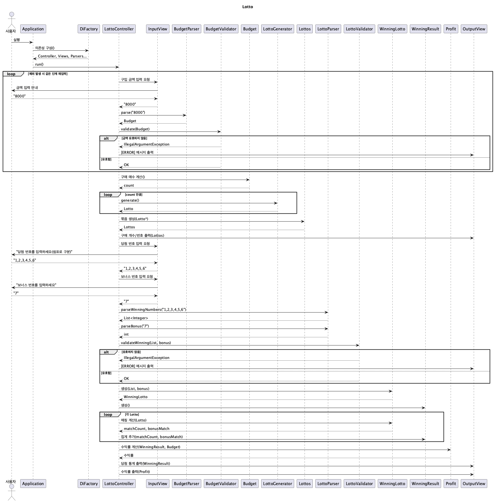

# java-lotto-precourse

### 기능 요구 사항
- 로또 번호의 범위는 1~45이다.
- 1개의 로또는 중복 없는 6개의 숫자로 구성된다.
- 당첨 번호는 중복 없는 6개 숫자와 보너스 번호 1개로 구성된다.
- 당첨 번호와 보너스 번호는 중복 불가능 하다.
- 로또 1장의 가격은 1,000원이다.
- 구입 금액을 입력하면, 해당 금액에 맞는 개수의 로또를 발행한다.
- 당첨 번호와 보너스 번호를 입력받는다.
- 사용자가 구매한 모든 로또와 당첨 번호를 비교하여 당첨 내역과 수익률을 출력한 뒤 프로그램을 종료한다.
- 구매 가능한 로또의 최대 개수는 2,147,483,647이다.

### 당첨 기준 및 상금
- 등수 및 상금은 다음과 같다.

| 등수 | 기준 | 상금 |
|---|---|---|
| 1등 | 6개 번호 일치 | 2,000,000,000원 |
| 2등 | 5개 번호 + 보너스 번호 일치 | 30,000,000원 |
| 3등 | 5개 번호 일치 | 1,500,000원 |
| 4등 | 4개 번호 일치 | 50,000원 |
| 5등 | 3개 번호 일치 | 5,000원 |

### 예외 및 에러 처리 규칙
- 잘못된 입력이 들어오면 `IllegalArgumentException`을 발생시킨다.
- 에러 메시지는 반드시 "[ERROR]"로 시작해야 한다.
- 동일 입력 단계에서 에러 발생 시, 해당 단계부터 입력을 다시 받는다.
- `Exception` 포괄 처리 금지. `IllegalArgumentException`, `IllegalStateException` 등 명확한 유형만 처리한다.

### 기능 구현 목록

#### 입력
-[x] 로또 구입 금액 입력 기능
-[x] 당첨 번호 입력 기능
-[x] 보너스 번호 입력 기능

#### 출력
-[x] 구매한 로또 개수 출력 기능
-[x] 구매한 로또 번호 목록 출력 기능
-[x] 당첨 내역 출력 기능
-[x] 수익률 출력 기능
-[x] 에러 메시지 출력 기능

#### 파싱
-[x] 당첨 번호 파싱 기능

#### 검증
-[x] 로또 구입 금액 검증 기능
-[x] 당첨 번호 검증 기능
-[x] 보너스 번호 검증 기능

#### 로또 구매
-[x] 구입 금액으로 로또 개수 계산 기능
-[x] 로또 번호 생성 기능

#### 당첨 판단
-[x] 구매 번호와 당첨 번호 비교 기능
-[x] 보너스 번호 일치 여부 판정 기능
-[x] 등수 결정 기능

#### 수익 관리
-[x] 수익률 계산 기능

#### 출력 데이터 구성
-[x] 당첨 통계 포맷 생성 기능
-[x] 수익률 포맷 생성 기능

### 패키지 구조

```text
lotto
├─ Application
├─ common
│  ├─ constant
│  │  └─ LottoConstant
│  └─ message
│     ├─ ErrorMessage
│     ├─ InputMessage
│     └─ OutputMessage
├─ config
│  └─ DiFactory
├─ controller
│  └─ LottoController
├─ domain
│  ├─ finance
│  │  ├─ Budget
│  │  └─ Profit
│  ├─ lotto
│  │  ├─ Lotto
│  │  ├─ LottoGenerator
│  │  ├─ Lottos
│  │  └─ RandomLottoGenerator
│  └─ winning
│     ├─ Rank
│     ├─ WinningLotto
│     └─ WinningResult
├─ dto
│  ├─ PurchasedLotto
│  ├─ WinningReport
│  └─ WinningReportEntry
├─ util
│  ├─ parser
│  │  ├─ BudgetParser
│  │  └─ LottoParser
│  └─ validator
│     ├─ BudgetValidator
│     └─ LottoValidator
└─ view
   ├─ InputView
   └─ OutputView
```

### 클래스별 책임

- **root**
  - `Application`: 애플리케이션 시작점. DI 초기화 후 `LottoController` 실행.

- **common.constant**
  - `LottoConstant`: 로또 번호 범위, 개수, 가격 등 전역 상수 정의.

- **common.message**
  - `ErrorMessage`: 예외 상황별 에러 메시지 상수.
  - `InputMessage`: 입력 안내 메시지 상수.
  - `OutputMessage`: 출력 포맷/라벨 메시지 상수.

- **config**
  - `DiFactory`: controller, view, parser, validator, generator 등 객체 생성 및 의존성 주입 구성.

- **controller**
  - `LottoController`: 오케스트레이션. 입력 수집 → 로또 발행 → 당첨 비교 → 통계/수익률 계산 → 출력. 입력 단계별 예외 발생 시 해당 단계부터 재입력 흐름 제어.

- **domain.finance**
  - `Budget`: 구입 금액 값 객체. 금액 유효성 보장 및 구매 가능 매수 계산 제공.
  - `Profit`: 총 상금과 투자 대비 수익률 계산 로직 보유.

- **domain.lotto**
  - `Lotto`: 중복 없는 6개 숫자의 불변 컬렉션. 범위/중복/개수 검증 포함.
  - `LottoGenerator`: 로또 생성 전략 인터페이스.
  - `RandomLottoGenerator`: 난수 기반 로또 생성 구현.
  - `Lottos`: 구매한 복수의 `Lotto` 묶음. 순회/조회 및 크기 계산 제공.

- **domain.winning**
  - `Rank`: 등수와 상금 매핑, 일치 개수로 등수 조회 기능 제공.
  - `WinningLotto`: 당첨 번호 6개와 보너스 번호 보유. 주어진 `Lotto`와의 일치/보너스 판정 제공.
  - `WinningResult`: 여러 로또의 판정 결과 집계. 등수별 개수/총상금 합산 기능 제공.

- **dto**
  - `PurchasedLotto`: 구매 결과 전달용 DTO. 구매 매수와 번호 묶음 노출.
  - `WinningReport`: 출력용 당첨 통계 요약 DTO.
  - `WinningReportEntry`: 출력용 등수별 상세 항목 DTO.

- **util.parser**
  - `BudgetParser`: 문자열 입력을 `Budget`으로 파싱.
  - `LottoParser`: 문자열 입력을 로또 번호 `Lotto`로 파싱.

- **util.validator**
  - `BudgetValidator`: 금액 형식/음수/단위(1,000원) 등 검증.
  - `LottoValidator`: 숫자 개수, 범위(1~45), 중복 여부 등 검증.

- **view**
  - `InputView`: 입력 메시지 출력 및 사용자 입력 수집(문자열 단위).
  - `OutputView`: 구매 내역, 당첨 통계, 수익률 등 결과 포맷팅 출력.


---

## 회고

### 개발 집중 포인트 (4가지)

1. **싱글톤 객체 관리**  
2. **시스템 상태 예외(`IllegalStateException`) 처리에 대한 고찰**  
3. **도메인 분리와 책임 경계의 명확화**  
4. **테스트 코드의 역할과 책임 분리**

---

#### 1. 싱글톤 객체 관리
- **Lazy Holder 패턴 적용**  
  - `RandomLottoGenerator`를 Lazy Holder 방식으로 구현하여 클래스 로딩 시점과 초기화 시점을 분리.  
  - 필요 시점에만 객체를 생성하도록 하여 불필요한 리소스 사용을 방지.  
- **의존성 주입 구조 개선**  
  - `DiFactory`를 통해 의존성을 명시적으로 주입하고, 테스트 환경에서도 동일 인스턴스를 활용 가능하게 설계.  
- **느낀 점**  
  - 단순히 “한 번만 생성되는 객체”가 아니라 **객체의 생명주기와 생성 시점을 제어하는 설계적 사고**가 중요함을 깨달음. 

---

#### 2. 상태 예외 처리
- **입력값 오류 → `IllegalArgumentException`**,  
  **시스템 상태 오류 → `IllegalStateException`** 으로 구분.  
- **적용 예시**  
  - 로또를 구매하지 않은 상태에서 당첨 결과를 계산하는 경우,  
    입력은 정상이지만 시스템 상태가 비정상적이므로 `IllegalStateException` 처리.  
- **느낀 점**  
  - 예외는 시스템의 책임 경계를 명확히 표현하는 수단이라는 점을 인지하게 됨.  

---

#### 3. 도메인 분리  
- **도메인 구성:** `finance`, `lotto`, `winning`  
  - `finance`: 금전 계산 및 수익률(`Budget`, `Profit`)  
  - `lotto`: 로또 생성 및 관리(`Lotto`, `Lottos`, `LottoGenerator`)  
  - `winning`: 당첨 판단 및 결과 계산(`WinningLotto`, `WinningResult`, `Rank`)  
- **설계 원칙**  
  - 도메인의 행위와 책임을 명확히 분리.  
  - `getter` 사용을 최소화하고, 객체가 스스로 상태를 관리하도록 설계.  
- **느낀 점**  
  - “물리적 분리”보다 “의미적 분리”가 더 중요하며,  
    각 도메인이 스스로의 책임을 가지는 구조가 유지보수성과 확장성을 결정한다는 점을 체감함.  

---

#### 4. 테스트 코드의 역할  
- 테스트를 작성하며 **테스트 범위와 책임 분리의 중요성**을 깊이 느꼈음.  
- 단위 테스트를 명확히 나누고 중복을 줄이면서 테스트가 설계 검증의 도구로 발전.  
- **초기 요구사항이 명확해야 테스트 코드가 불필요하게 수정되지 않는다**는 사실을 배웠음.  
- **결론**  
  - 테스트는 설계 품질을 유지하고 방향성을 점검하는 핵심 프로세스임을 깨달음.  

---

👉 이번 과제를 통해 객체의 생명주기, 시스템 상태, 도메인 경계, 테스트 책임 등  
코드의 “동작”보다 “설계와 구조의 완성도”에 초점을 맞추는 개발자로 성장할 수 있었음.

---

## sequence diagram



---